# Comparative Analysis of Self-Supervised and Supervised Learning Architectures for Image Analysis

## The Core Problem

**Context**: In real-world agricultural scenarios supervised learning requires expert-annotated images.

**The Challenge**: Acquiring large, high-quality labeled datasets is extremely expensive, time-consuming, and a major bottleneck.

**The Research Question**: How does the paradigm of self-supervised learning (DINO) compare to traditional supervised method Convolutional Neural Network (CNN) in navigating the critical trade-offs between data scarcity and label scarcity for fine-grained agricultural image classification?

## DATA

Dataset sourced from local farms in Ghana.

The raw images which consist of 24,881 images (6,549-Cashew, 7,508-Cassava, 5,389-Maize, and 5,435-Tomato) categorized into 22 classes. Also it consists of high-resolution images with varied dimensions ranging from 400x400 to 4032x3024 pixels.

Source: https://data.mendeley.com/datasets/bwh3zbpkpv/1

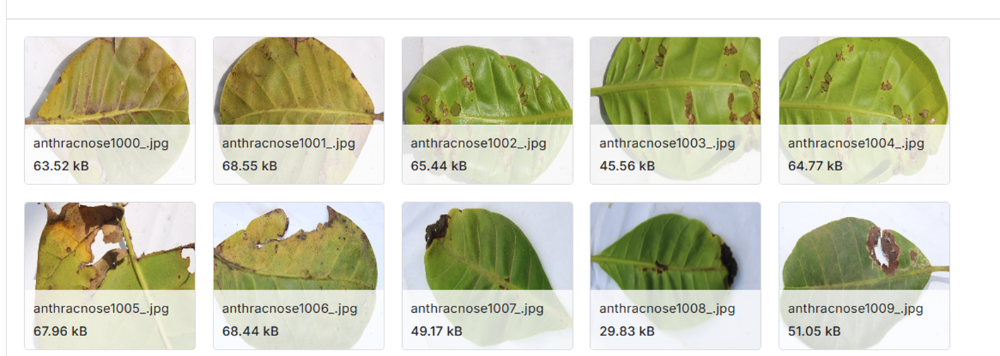

## Models

### Supervised CNN (Baseline)
- **Model**: EfficientNet-B4
- **How it is trained**: Used pre-trained model and fine-tuned on the data.

### Supervised Vision Transformer (ViT)
- **How it is trained**: Used pre-trained model and fine-tuned on the data.

### Self-Supervised (SSL)
- **Model**: DINOv2 (a ViT backbone)
- **How it is trained**: Used pre-trained model and also:
  - **Linear Probing (LP)**: Freeze the backbone; only train the final layer.
  - **Fine-Tuning (FT)**

## 28 Experiments

| Models | Regimes | Label Experiments (%1, %10, %50, %100) | Data Experiments (%5, %25, %50) |
|--------|---------|----------------------------------------|---------------------------------|
| CNN | supervised | 4 | 3 |
| ViT | supervised | 4 | 3 |
| DINOv2 | self-supervised (fine_tune + linear_probe) | 4 + 4 | 3 + 3 |
| **TOTAL** | - | **16** | **12** |

## Performance Under Data and Label Scarcity

### DINOv2's Superiority in Data-Scarce Environments

Self-Supervised Learning (SSL), particularly DINOv2, provided substantial resilience and a measurable advantage under conditions of extreme data and label scarcity, demonstrating its superior label efficiency.

240 samples, DINOv2 models (both Fine-Tuning and Linear Probing) achieved the highest performance (56% accuracy). 

The CNN baseline achieved 51.2% accuracy, 

The supervised Vision Transformer (ViT) performed the worst (22.6%). 

This confirms the inherent separability and discriminative power of self-supervised embeddings.

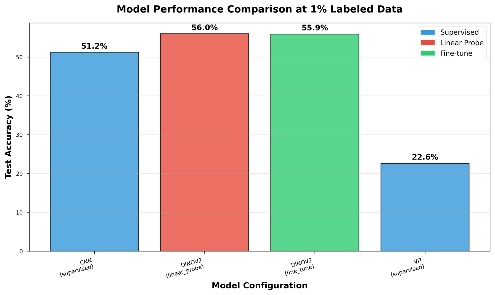

## Detailed results

- **DINOv2 FT** has the highest precision (0.623)
- **CNN** has the highest recall (0.538)
- **DINOv2 FT** has the highest F1-score (0.503)
- **ViT** performs very poorly at 1% labels

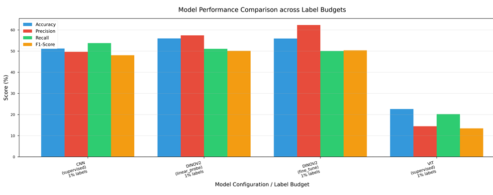

13% difference in Precision and only 4% difference in Recall

| Model | Acc (1%) | Precision | Recall | F1-Score |
|-------|----------|-----------|--------|----------|
| CNN | 51.2% | 0.497 | 0.538 | 0.480 |
| DINOv2 LP | 56.0% | 0.574 | 0.510 | 0.501 |
| DINOv2 FT | 55.9% | 0.623 | 0.500 | 0.503 |
| ViT | 22.6% | 0.145 | 0.202 | 0.135 |

## The Advantage Diminishes

With abundant labeled data, the SSL advantage fades and CNNs excel.

<table>
  <tr>
    <td>
      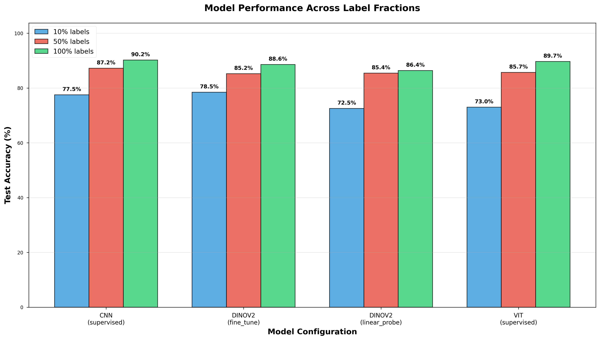
    </td>
    <td style="vertical-align: top; padding-left: 20px;">
      <h4>At 100% Labeled Data:</h4>
      <ul>
        <li><strong>CNN (Supervised)</strong>: 90.2%</li>
        <li><strong>DINOv2 (FT)</strong>: 88.6%</li>
        <li><strong>ViT (Supervised)</strong>: 89.7%</li>
      </ul>
    </td>
  </tr>
</table>

## Label Efficiency

Few-shot performance on label scarcity.
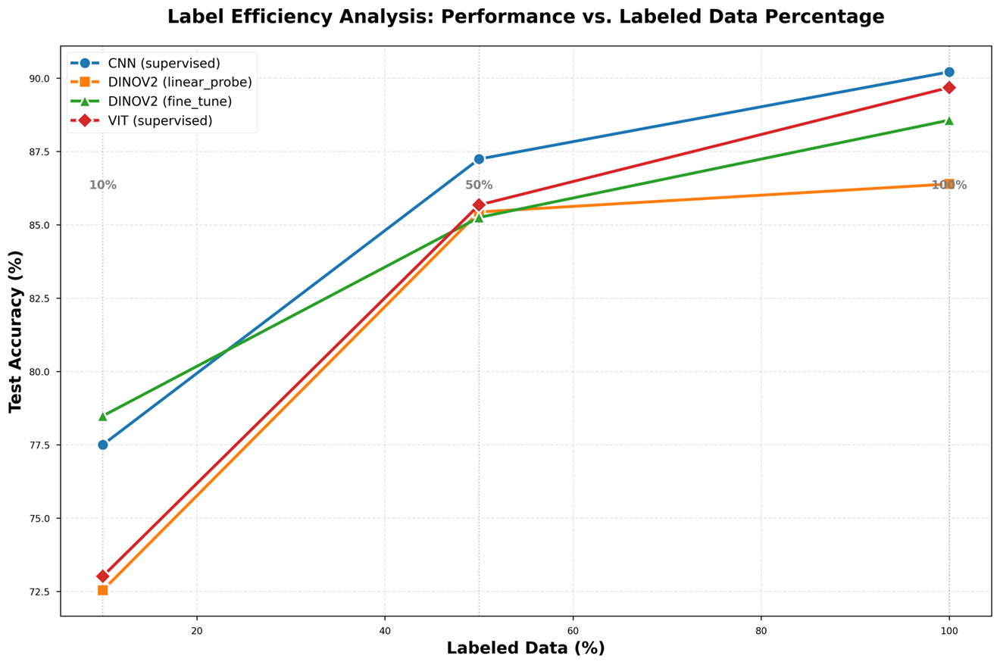

## Impact of Model Architecture and Fine-Tuning 10% labeled data

<table>
  <tr>
    <td>
      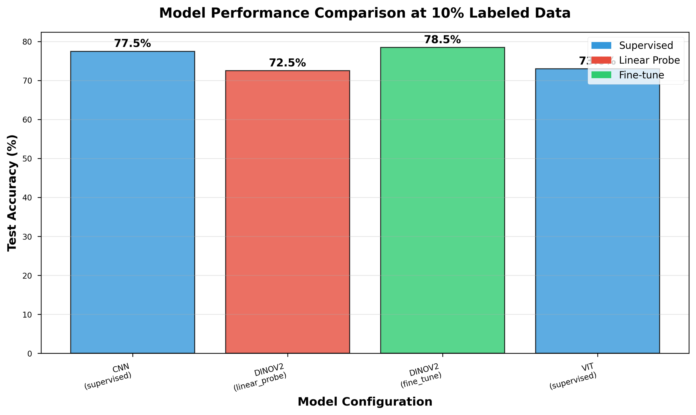
      
Unfreeze = 15

    </td>
    <td>
      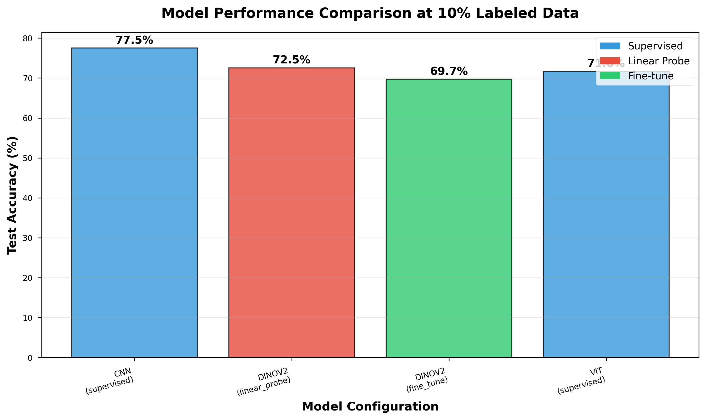
      
Unfreeze = 3

    </td>
  </tr>
</table>

## %100 labeled data

<table>
  <tr>
    <td>
      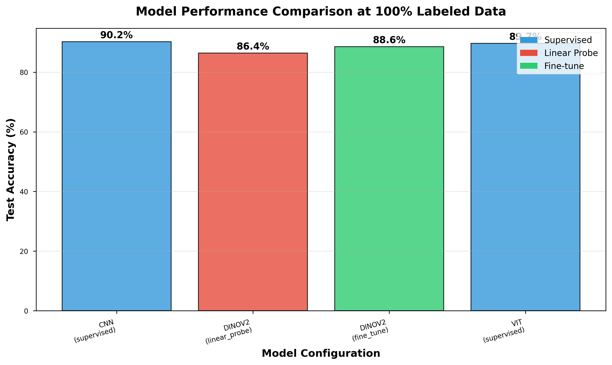
      
Unfreeze = 15

    </td>
    <td>
      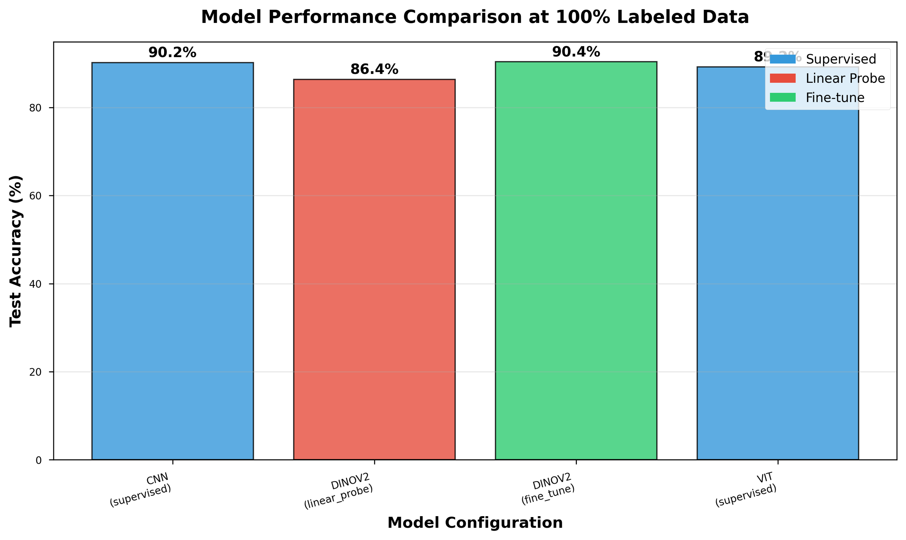
      
Unfreeze = 3

    </td>
  </tr>
</table>

## Data Efficiency

I have not only cut the labels but also the data amount.

5%, 25%, 50% data in total has been taken away.

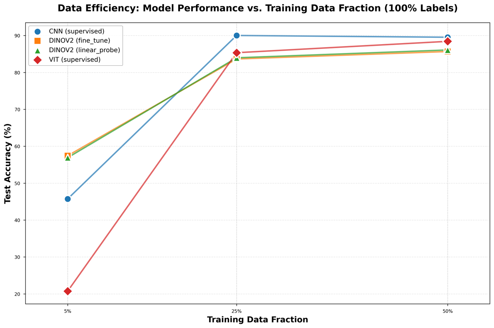

## Some Important Details

Here we see all the models true and planned epochs. Models early stopped to prevent the overfitting.

I used an NVIDIA A100 80GB GPU with 20 CPU cores on a rented remote server.

- **CNN** hits 90.0 accuracy at 25 data and remains at 90.2 at 100 labels. Adding 4x more data, moving from 25% to 100%, yielded almost 0% improvement
- **At 5% data and %1 labels**, Supervised ViT fails, while DINOv2 is leading. Same architecture.
- **50% Data**: CNN = 89.5%, ViT = 88.4% and **50% Labels**: CNN = 87.2%, ViT = 85.7%. Image diversity is more important than label density therefore the model generalizes better to unseen variations.

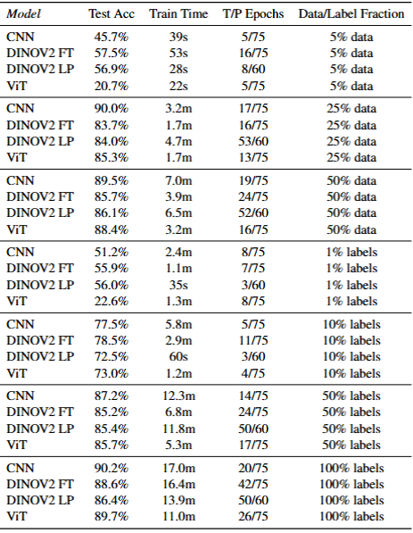

## Training Details

These results are Label experiment %100 Label based

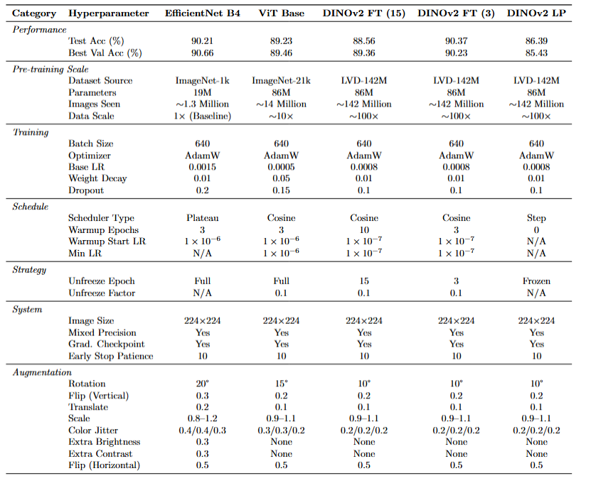

## Example of scaling with only with data not labels DINOv3

*Oquab et al., "DINOv3: Scaling Vision Transformers," arXiv, 2025.*

<table>
  <tr>
    <td>
      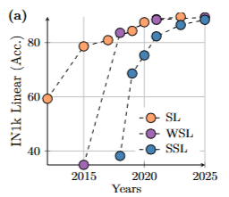
    </td>
    <td>
      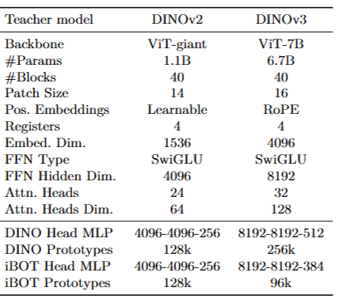
    </td>
    <td>
      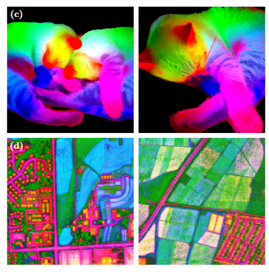
    </td>
  </tr>
</table>

